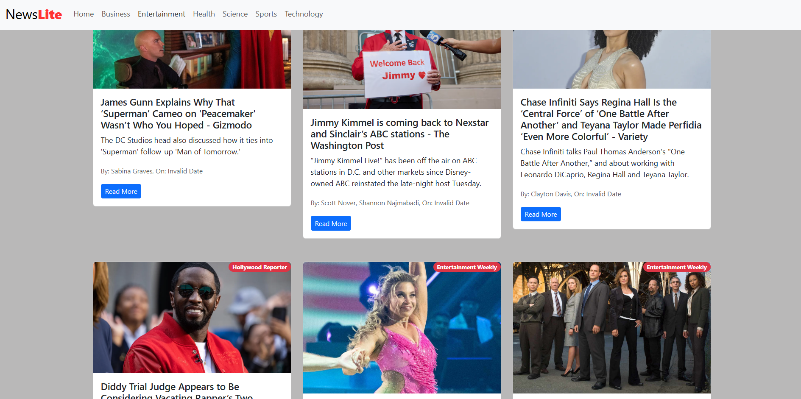

# NewsLite
Lite news, Big impact

## Objective

The objective of NewsMonkey is to provide users with a fast, reliable, and user-friendly platform to stay updated with the latest news from various categories. The app aims to aggregate news articles from trusted sources and present them in an organized and accessible manner.

## Overview

NewsMonkey is a React-based news application that fetches and displays news articles across multiple categories such as Business, Entertainment, Health, Science, Sports, and Technology. The app features a responsive design, infinite scrolling for continuous news updates, and a top-loading bar for enhanced user experience. Modular components like News, NavBar, NewsItem, and Spinner ensure maintainability and scalability. The application leverages modern React features and libraries to deliver a seamless browsing experience.


## How to Clone and Set Up This Application

1. **Clone the repository from GitHub:**
   ```sh
   git clone https://github.com/your-username/newsMonkey.git
   ```
   *(Replace `your-username` with the actual GitHub username if needed.)*

2. **Navigate to the project directory:**
   ```sh
   cd newsMonkey
   ```

3. **Install the dependencies:**
   ```sh
   npm install
   ```

4. **Set up environment variables:**
   - Create a `.env` file in the root directory.
   - Add your News API key:
     ```
     VITE_NEWS_API_KEY=your_api_key_here
     ```
     *(Replace `your_api_key_here` with your actual News API key.)*

5. **Start the development server:**
   ```sh
   npm run dev
   ```

6. **Open the application:**
   - Visit [http://localhost:5173](http://localhost:5173) in your browser.

---

## Components

There are many components in the News Apps. Like:

- **News Components**
- **navBar Components**
- **NewsItem Components**
- **Spinner Components**

To build the website we use some important files, like:

- **InfiniteScroll**
- **React-Top-loading-bar**

There are many more news categories in the navBar component, like:

- Business
- Entertainment
- General
- Health
- Science
- Sports
- Technology

## Snapshots

**Shot 1:**  


**Shot 2:**  


## Future Work

- **Authentication System:** Implement user authentication to allow personalized news feeds and user preferences.
- **Bookmarking:** Enable users to save or bookmark their favorite articles for later reading.
- **Dark Mode:** Add a dark mode option for better accessibility and user comfort.
- **Push Notifications:** Integrate push notifications to alert users about breaking news.


NewsMonkey is continuously evolving to provide a better and more personalized news reading experience.


Thanks for read this.